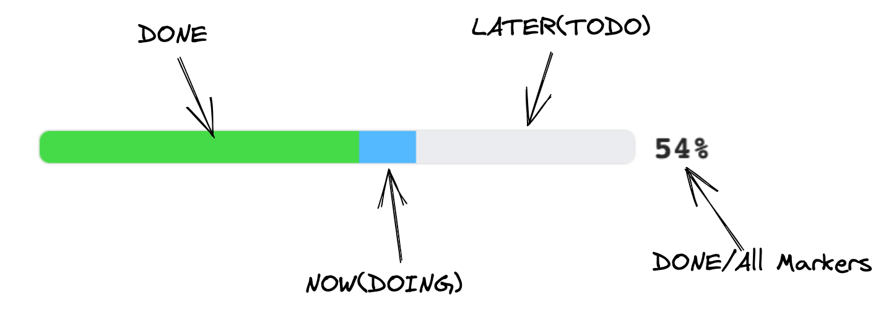

# Logseq Plugin TODO Master

A simple plugin to render a progress bar to gather the overall progress of the TODO markers based on the rendering position.



## Usage

Use slash command `[TODO Master] Add Progress Bar` to add a progress bar macro `{{renderer :todomaster}}` .
The progress will be calculated based on the position of the macro.

- If the macro has children blocks, it will show the progress of the children blocks
- If the macro is at the root of the page (without a parent block) and has no children blocks, it will show the progress of the current page
- If the macro is rendering in a block which has a query block, it will show the progress of the query block

### Tips

Since this macro `{{renderer :todomaster}}` will display progress based on the rendering block, you can place it in the journal template, or in a query block title. Here are some examples:

#### Add Todo Master into the page's properties

```md
progress:: {{renderer :todomaster}}
```

#### Add Todo Master into the page's properties

```md
progress:: {{renderer :todomaster}}
```